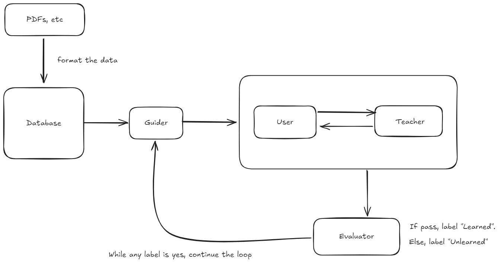

# AI_Education
Shaping the Future of Learning

这是一个多智能体的Problem-Based Learning (PBL) 教育系统。系统的目标是通过对话式交互，帮助用户掌握数据库中的一系列知识点，并实现自动化的学习过程评估与反馈。

## 一、Agents

### 1. Guider

- 目的：给出欢迎语并根据数据库中的入门级别问题生成3-5个推荐问题或方向，创建不仅能吸引用户而且能促进批判性思维和理解的问题。

- 特点：对于已经学过的问题，会在数据库中标记已学，最后当数据库中所有问题都标记为已学，告知用户这部分内容完成。

- prompt：

  ```
  <待补充>
  ```

### 2. UserProxy

- 目的：模拟用户提问和交互。

### 3. Teacher

- 目的：依据用户提问进行详细解答和对话，询问用户是否理解内容。如果用户已经掌握知识，则将信息传递给Evaluator进行评估。

- 特点：优秀教导能力。

- prompt：

  ```
  <待补充>
  ```

### 4. Evaluator

- 目的：评估用户的学习进度和知识掌握程度，基于提供的材料生成测评题目，评估用户回答并提供建议。用固定的格式提供评估结果。

- 特点：严格的进度评估和反馈。

- prompt：

  ```
  <待补充>
  ```

## 二、Workflow



While（当有任意数据库中存在问题的"learned"字段为No时，执行以下循环）：

1. **Guider**：提供欢迎语和引导性的问题（后续循环中，提供的问题从“learned”字段为No的问题中提取）。
2. **UserProxy**：用户提问。
3. 使用**similarity_match**函数，匹配相似的n个QA，将query+n个QA通过提示词形式传给**Teacher**。
4. **Teacher**和**UserProxy**完成学习对话，触发stopword后，将信息传递给**Evaluator**。
5. **Evaluator**：
   - 对**UserProxy**所学知识点进行测评。
   - 根据用户回答提供建议。
   - 若认为用户掌握该部分内容，将数据库中的“learned”字段改为Yes。
6. 计算学习进度：
   - 若所有"learned"字段均为Yes，祝贺用户完成学习；
   - 若有未完成学习的QA，返回Step 1继续学习，直到所有问题完成。

## 三、About DataBase

Currently using a MySQL database, the table is t1.
```sql
-- auto-generated definition
create table t1
(
    id                  int(10) auto_increment
        primary key,
    course_name         varchar(20)          null,
    question            varchar(100)         null,
    content_correlation varchar(20)          null,
    question_depth      varchar(20)          null,
    learning_process    varchar(20)          null,
    learner_tag         tinyint(1) default 0 null,
    answer              varchar(1000)        null
);
```

### Field Descriptions

- `course_name`:课程名称，表示该条数据对应的课程
- `question`:问题文本，包含待回答的问题内容
- `content_correlation`:内容相关性，字段值可选如下四种：
    - 背景知识：提供背景信息
    - 核心内容：与主题直接相关的主要信息
    - 主要内容：关键点和主题的主要内容
    - 延伸内容：拓展性的信息，包含附加知识
- `question_depth`:问题深度，字段值可选如下六种：
    - 基础问题：基础知识问题
    - 理解问题：测试理解能力的问题
    - 应用问题：应用知识于实际问题的问题
    - 分析问题：分析与解构信息的问题
    - 评估问题：对信息进行评估的问题
    - 综合问题：综合多方面知识的问题
- `learning_process`:学习进度，字段值可选如下六种：
    - 入门阶段：初学者阶段
    - 深化阶段：知识深化阶段
    - 应用阶段：知识应用阶段
    - 综合阶段：综合知识运用阶段
    - 拓展阶段：拓展与深入学习阶段
    - 独立：独立掌握知识的阶段
- `learner_tag`:学习者标签，标识学习者的状态（默认为0），表示学习者还没有学会这道题目
- `answer`:答案字段，应包含从该文本中提取出的正确回答


